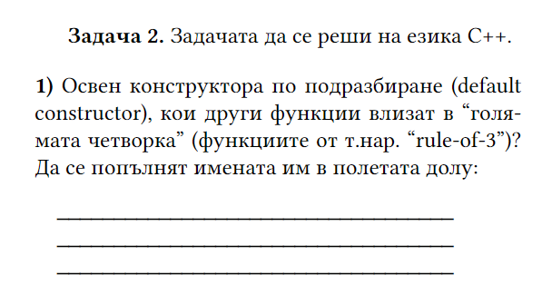
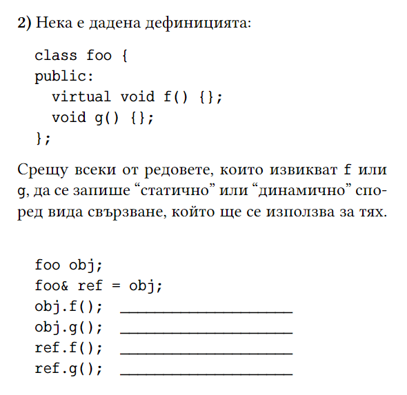
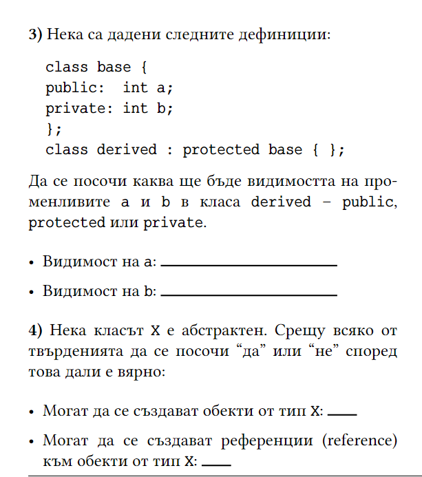

# Множествено наследяване и диамантен проблем - 20.05.2026

## Множествено наследяване
Правилата за наследяване са същите като при единичното наследяване.
```c++
#include<iostream>
using namespace std;

class A
{
public:
A() { cout << "A's constructor called" << endl; }
};

class B
{
public:
B() { cout << "B's constructor called" << endl; }
};

class C: public B, public A // Note the order
{
public:
C() { cout << "C's constructor called" << endl; }
};

int main()
{
	C c;
	return 0;
}

```

Може да има нееднозначни извиквания, ако в базовите класове има член-функции с еднакви имена.
```c++
struct A {
	void print() const {
		std::cout << "Hello, A!" << std::endl;
	}
};

struct B {
	void print() const {
		std::cout << "Hello, B!" << std::endl;
	}
};

struct C: public A, public B {
};

C c;
c.print(); // Не е ясно кой print трябва да се извика!
c.A::print();
c.B::print();
```

## Диамантен проблем
Примерна реализация на класове с виртуално наследяване:
```c++
#include <iostream>
#include <string>

class Animal {
public:
    Animal(std::string name): name(name) {
        std::cout << "Constructor Animal" << std::endl;
    }
private:
    std::string name;
};

class Mammal : virtual public Animal {
public:
    Mammal(std::string name): Animal(name) {
        std::cout << "Constructor Mammal" << std::endl;
    }
};

class Spy : virtual public Animal {
public:
    Spy(std::string name) : Animal(name) {
        std::cout << "Constructor Spy" << std::endl;
    }
};

class Platypus : public Mammal, public Spy {
public:
    Platypus(std::string name) : Animal(name), Spy(name), Mammal(name) {
        std::cout << "Perry The Platypus" << std::endl;
    }
};

int main()
{
    Platypus perry("Perry");
	return 0;
}
```
Резултат в конзолата:
```
Constructor Animal
Constructor Mammal
Constructor Spy
Perry The Platypus
```


## Задачи
## 1. задача (от ДИ)




## 2. задача
[Задача от Стела](https://github.com/ariolandi):
Фирма произвежда няколко вида шоколади:
- млечен (с идентификационен номер цяло число, съдържа информация за количеството мляко в състава му)
- черен (с идентификационен номер низ, съставен само от малки и големи латински букви, съдържа информация за количеството какао състава му)
- със стафиди (съдържа информация за количеството стафиди в състава му)
- млечен със стафиди (идентификационният номер започва с 45)
- черен със стафиди (идентификационният номер започва с S)

Информацията за оптималната наличност на шоколади се намира в списък, съдържащ идентификационните кодове и количеството от даден вид.

**Пример:**    
5432 12    
black 35     
someld 13     
45123 100     
Sabcd 53     
     

Реализирайте клас склад с множество шоколади, притежаващ следната функционалност:
- създаване на нов склад чрез подаване на списък с наличностите
- попълване на склада - ако в склада не се среща шоколад с даден идентификационен номер, присъстващ в списъка, такъв се добавя
- продаване на шоколад - премахване от резерва на склада
- справка за наличните шоколади
      
Нека по подразбиране млечният шоколад съдържа 35% мляко, черният - 80% какао, а този със стафиди - 20% стафиди.

## 3.1 задача
Реализирайте структура от класове за следния случай:   
В софтуерна фирма има два вида служители – **ИТ специалисти** и **мениджъри**. ИТ специалистите се делят на два вида - **програмисти** и **QA**.

За **програмистите** се поддържа следната информация:

- име;
- стаж (в месеци);
- заплата;
- проект, върху който работи
- език, на който програмират


За **QA** се поддържа:

- име;
- стаж (в месеци);
- заплата;
- проект, върху който работи
- дали са automation или manual tester

За **мениджърите** се поддържа:

- име;
- стаж (в месеци);
- заплата;
- колко човека управлява.

## 3.2 задача
а) Създайте клас за проектите, който да съдържа информация за:

име
сложност, число от 1 до 10
Добавете възможност ИТ специалистите (програмисти и QA) да могат да участват в повече от един проект.

б) Тъй като нашата ИТ фирма иска да оцени усилията, които служителите полагат, всяка година увеличава заплатата им спрямо работата, която са свършили.
Имплемнетирайте функция annual_raise за всяка една от ролите, която калкулира и увеличава заплатата на съответния служител по следния начин:

Увеличението на заплатата при програмистите е:

6% ако средната сложност на проектите, по които работят е от 1 до 4
12% ако средната сложност на проектите, по които работят е от 5 до 7
15% ако средната сложност на проектите, по които работят е от 8 до 10
Увеличението на заплатата при manual QA е:

5% ако броят проекти, по които работят е 1
10% ако броят проекти, по които работят е 2 или 3
15% ако броят проекти, по които работят е над 3
Увеличението на заплатата при automation QA е:

5% ако средната сложност на проектите, по които работят е от 1 до 4
10% ако средната сложност на проектите, по които работят е от 5 до 7
15% ако средната сложност на проектите, по които работят е от 8 до 10
Увеличението на заплатата при мениджърите е:

6% ако управляват от 1 до 10 души
12% ако управляват от 11 до 15 души
15% ако управляват над 15
в) Създайте клас System, който да съдържа следната информация за фирмата:

годишен бюджет
масив от служители
масив от проекти, които разработва
Имплементирайте метод annual_raises, който увеличава заплатата на всеки от служителите, които работят в компанията, и намаля съответно годишния бюджет.

## 4. задача
Реализирайте клас **TaskManager**, който пази списък от задачи и помага да следите прогреса по тях. Има няколко вида задачи:

- Проста задача - извършва се за единица време    
- Дълга задача - извършва се за няколко единици време    
- Сложна задача - съдържа множество задачи.   

Всяка задача се характеризира с:

- описание
- големина
- прогрес
- дали е завършена
     

Всички задачи имат метод **work**, който приема цяло положително число (колко време отделяте на задачата) и връща цяло неотрицателно число - колко време ви остава след работата по задачата (в случай, че задачата изисква 2 единици време,а вие подадете 3, функцията ще върне 1). Всички задачи имат метод Print, който приема изходен поток (по подразбиране **std::cout**) и изписва на него типа на задачата, описанието, големината и прогреса по задачата.